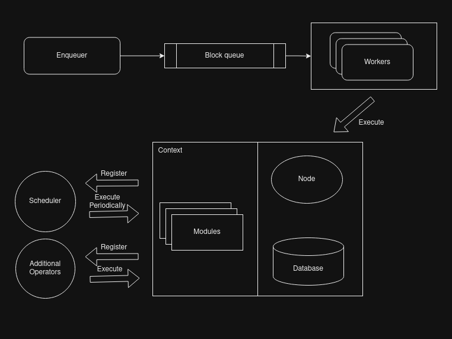

# ADR-001: General parser architecture


## Changelog

- March 11th, 2024: Init draft;
- March 13th, 2024: First draft;    

## Status

PROPOSED

## Abstract

This ADR outlines the general parser architecture designed for Juno, addressing the need for enhanced interfaces to support various chains.

## Context

Juno currently lacks the necessary architecture documents and interfaces to effectively support multiple chains. Additionally, it faces challenges in handling messages and transactions, especially when dealing with different blockchain protocols and versions. There is a pressing need to establish a robust and adaptable architecture that can accommodate the diverse requirements of various chains while maintaining efficiency and reliability. 

## Decision

To address these challenges, the decision is made to redesign Juno's parser architecture. The architecture will prioritize modularity and extensibility, allowing seamless integration with different blockchain networks and protocols. Key components such as enqueuers, workers, and modules will be defined with clear responsibilities and interfaces to facilitate easy extension and customization. Moreover, the architecture will incorporate mechanisms to handle transactions, messages, and other blockchain operations efficiently.
 
The provided image offer a comprehensive overview of the Juno parser, detailing its core components and functionalities.



Let's break down each element briefly by following topics.

### Context

The Context interface acts as a central hub shared among all elements within the parser, including enqueuers, workers, and other components.

```go
type Context interface {
    // Context represents the manager for the concurrent jobs
    context.Context

    // Database returns the database used to operate blocks by workers
    Database() Database

    // Node returns the client used to listen to blocks by enqueuers
    Node() Node
    
    // Modules returns a set of the extensional operations that should be executed inside a worker
    Modules() []Module
}
```

### Block

The Block interface serves as a representation of the aggregation of operations on the blockchain and is the fundamental element transferred within the queue for parsing by workers within Juno.

```go
type Block interface {
    // Height returns the height of the block.
    Height() uint64

    // Hash returns the hash of the block.
    Hash() string

    // Timestamp returns the timestamp of the block.
    Timestamp() time.Time

    // Proposer returns the address of the block proposer.
    Proposer() string
}
```

### Enqueuer

The Enqueuer interface orchestrates the process of listening for available blocks and enqueueing them into the queue for parsing by workers.

In the current version, two types of enqueuers are implemented:

* Missing Blocks Enqueuer: This enqueuer queries missing blocks from the given start block to the current latest block and enqueues them into the queue.
* New Blocks Enqueuer: This enqueuer listens for new blocks from the node and enqueues them into the queue.

```go
type Enqueuer interface {
    // ListenAndEnqueueBlocks listens for available blocks and enqueues them into the queue.
    ListenAndEnqueueBlocks(ctx Context, queue BlockQueue) (err error)
}
```

### Block Queue

The BlockQueue interface serves as a communication channel between enqueuers and workers within the Juno architecture.

```go
type BlockQueue interface {
    // Enqueue enqueues a block into the queue.
    Enqueue(block Block)
    
    // Listen returns a channel to listen for blocks.
    Listen() <-chan Block
}
```

### Node

The Node interface serves as an abstraction layer for interacting with RPC servers or other clients to obtain block data efficiently.

```go
type Node interface {
    // LatestBlock retrieves the latest block from the connected node.
    LatestBlock() (Block, error)

    // Block retrieves the block by the given height
    Block(height uint64) (Block, error)

    // SubscribeBlocks returns a channel to subscribe to new blocks from the connected node.
    SubscribeBlocks() (<-chan Block, error)
}
```

### Database

The Database interface encapsulates the necessary operations for interacting with the underlying storage system.

```go
type Database interface {
    // SaveBlock saves a block into the database.
    SaveBlock(block Block) error

    // LatestBlock returns the latest block from the database.
    LatestBlock() (Block, error)
}
```

### Worker

The Worker interface defines the functionality for parsing blocks from the queue within Juno's parser architecture.

```go
type Worker interface {
    // Start starts the worker to parse blocks from the queue.
    Start(ctx Context, queue BlockQueue)
}
```

### Scheduler

The Scheduler interface facilitates the execution of periodic operations within Juno's parser architecture.

```go
type PeriodicOperationsModule interface {
	// RegisterPeriodicOperations allows to register all the operations that will be run on a periodic basis.
	// The given scheduler can be used to define the periodicity of each task.
	// NOTE. This method will only be run ONCE during the module initialization.
	RegisterPeriodicOperations(scheduler Scheduler) error
}

type Scheduler interface {
    // Register registers a periodic operations module.
    Register(module PeriodicOperationsModule)

    // Start starts the scheduler.
    Start(ctx Context)
}
```

### Module

The Module interface serves as the foundation for defining and extending functionality within Juno's parser architecture.

Within Juno, a fundamental module called BlockModule is provided, dedicated to handling blocks.

Additionally, developers have the flexibility to create custom modules tailored to specific business requirements, such as TransactionModule, GovModule, and others.

```go
type Module interface {
    // Name returns the name of the module.
    Name() string
}

type BlockModule interface {
    // HandleBlock handles a block parsed by workers.
    HandleBlock(block Block) error
}
```

### Additional operator

The Additional Operator interface provides functionality for executing additional operations on a additional basis within Juno's parser architecture.

Currently, we utilize the additional operation module to host a Prometheus server.

```go
type AdditionalOperationModule interface {
    // RunAdditionalOperations runs all the additional operations required by the module.
	// This is the perfect place where to initialize all the operations that subscribe to websockets or other
	// external sources.
	// NOTE. This method will only be run ONCE before starting the parsing of the blocks.
    RunAdditionalOperations() error
}

type AdditionalOperator interface {
    // Register registers an additional operation module.
    Register(module AdditionalOperationModule)

    // Start starts the additional operator.
    Start(ctx Context)
}
```

## Consequences

### Backwards Compatibility

The decision to redesign Juno's parser architecture is not backwards compatible, as the current implementation only supports Cosmos SDK chains. The introduction of a new architecture with enhanced interfaces may require adjustments to existing codebases and integrations. However, this trade-off is necessary to accommodate the future expansion of Juno to support a wider range of blockchain networks beyond Cosmos SDK chains. Despite the lack of backwards compatibility, the long-term benefits of the redesigned architecture justify the need for this transition.

### Positive

* Improved Flexibility: The redesigned architecture will enable Juno to support a wider range of blockchain networks and adapt to evolving protocols more effectively.
* Enhanced Scalability: With a modular and extensible design, Juno will be better equipped to handle increasing volumes of transactions and messages from multiple chains.


### Negative

* Increased Development Complexity: Implementing a more sophisticated architecture may require additional development effort and resources.
* Potential Performance Overhead: Depending on the implementation, there may be a slight performance overhead associated with the modular design. However, this is outweighed by the benefits of improved flexibility and scalability.

### Neutral

unknown

## References

- {reference link}
