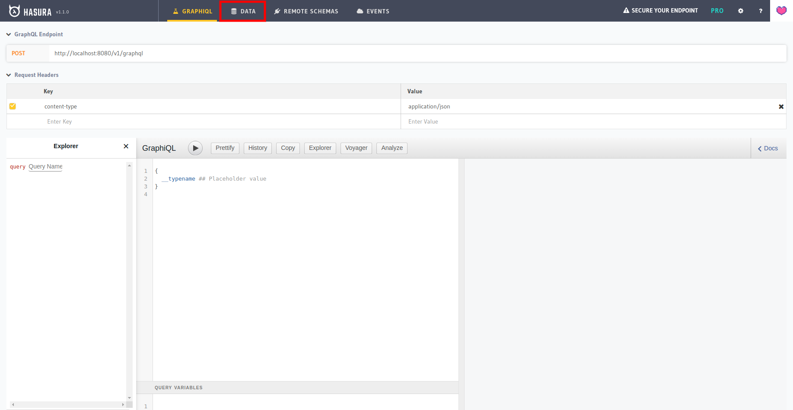
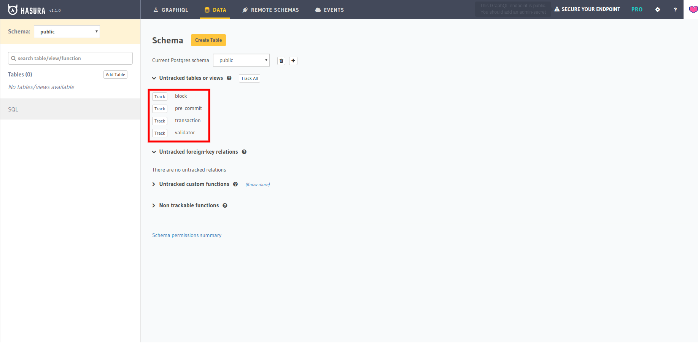
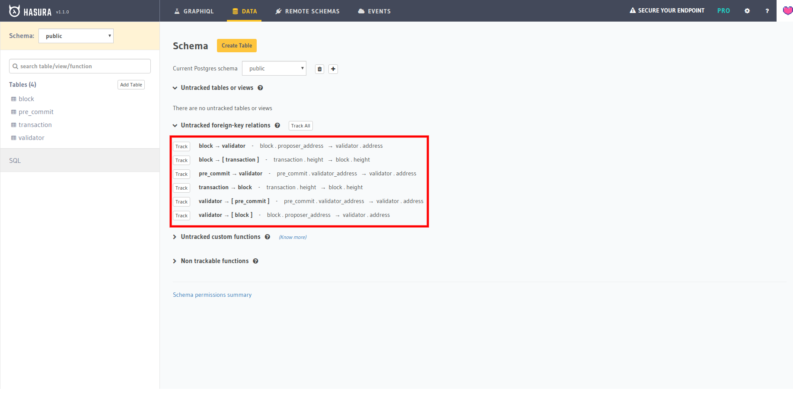
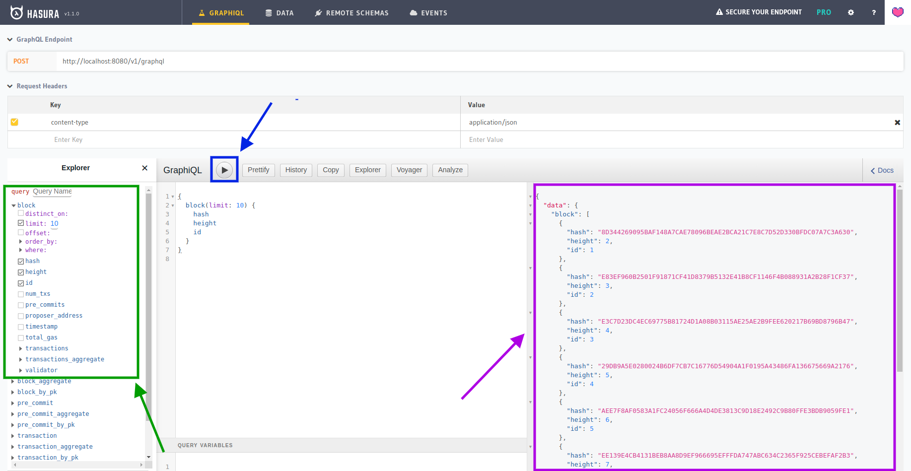

# PostgreSQL Setup with GraphQL
In order to properly setup this project to work with PostgreSQL and, at the same time, create a GraphQL endpoint, you need to perform some additional setup. 

## 1. Install PostgreSQL
First of all, install PostgreSQL following the [official documentation](https://www.postgresql.org/download/).

## 2. Create the Juno database 
Once you have installed PostgreSQL, you will need to create the Juno database. To do so, follow the below steps. 

1. Log into PostgreSQL with root access.
   ```bash
    sudo -u postgres psql
   ``` 
   
2. Configure PostgreSQL to make is accessible by your normal users. Change your_username with your actual user already created on your Ubuntu system.
   ```postgresql
   CREATE ROLE <your_username> WITH SUPERUSER LOGIN ENCRYPTED PASSWORD 'your_password';
   ``` 
   
3. Exit PostgreSQL
   ```bash
   \q
   ```
   
4. Create the Juno database and set yor user to be the owner. 
   ```bash
   createdb juno -O <your-username>
   ```
   
5. Log into the Juno database. 
   ```bash
   psql juno
   ```
   
6. Create all the required tables.  
   You can find the SQL schemes inside the [`postgresql` folder](../db/postgresql/schema.sql).
 
   
7. Exit PostgreSQL. 
   ```bash
   \q
   ```

## Setup the GraphQL APIs with Hasura
In order to easily setup the GraphQL APIs, we're going to use [Hasura](https://hasura.io/). This project will allow you to run a Docker container which exposes the GraphQL APIs allowing you to perform custom queries without much effort.

To get started with Hasura we need to perform the below steps.

1. Get the Hasura Docker script by executing the following command.  
   ```bash
   wget https://raw.githubusercontent.com/hasura/graphql-engine/stable/install-manifests/docker-run/docker-run.sh
   ```

2. Configure the script by editing its content so that it looks like the following.  
   **Note**. Replace `username`, `password`, `host`, `port` and `dbname` with the details to connect to your database you set up during the database creation.

3. Make the script executable.
   ```bash
   chmod +x ./docker-run.sh
   ``` 
   
4. Start the script. 
   ```bash
   ./docker-run.sh
   ```
   
If everything works out, you should be able to see the local GraphQL APIs explorer by browsing [localhost:8080](http://localhost:8080). 

## Setup Hasura
Once Hasura is properly running, you need to perform the last step to make sure it reads the proper data. 

To do so, log into Hasura and click on the _Data_ section on the top bar: 

[](http://localhost:8080/console/data/schema/public)

Now, from the _Untracked tables or views_ select the tables you want to track: 



Once you have selected the views to track you also need to select the foreign keys as well: 



Once you have done so, by going inside the _GraphiQL_ section you will be able to compose your query using the left side panel, run it using the _Play_ button and seeing the result on the right side panel: 

 
